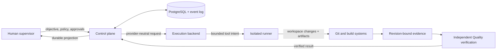

<p align="center">
  
</p>

<p align="center">
  <a href="https://github.com/Opperiesen/moonshift/actions/workflows/ci.yml"></a>
  <a href="LICENSE"></a>
  
  
  
</p>

<p align="center">
  <strong>Give one objective. Keep human authority. Delegate the software project.</strong>
</p>

Moonshift is an open-source, self-hosted workspace for autonomous software development under the
supervision of exactly one human. It is designed to turn a software objective into bounded,
observable work across persistent product, engineering, and quality roles—without making a model,
provider, harness, or chat session the system of record.

> [!IMPORTANT]
> Moonshift is an implementation-local **alpha**, not a supported production product. The current
> end-to-end slice uses deterministic fixtures: there are no real provider integrations, production
> deployment bundles, unrestricted repository shell, or general-purpose runner isolation yet.

## Why Moonshift

Most coding agents optimize a session. Moonshift is building the control system around the whole
project:

- **Human sovereignty** — one supervisor can inspect, approve, reject, pause, resume, or stop work.
- **Evidence over confidence** — completion requires revision-bound tests, artifacts, and independent
  verification.
- **Provider-neutral identities** — roles and durable state survive model, provider, or harness
  changes.
- **Bounded autonomy** — delegation, tools, budgets, time, depth, network, and sensitive effects are
  policy-controlled.
- **Durable recovery** — PostgreSQL state, checkpoints, idempotent effects, fencing, and reconciliation
  replace fragile chat history.
- **Self-hosted by design** — authoritative project, audit, policy, memory, and evidence remain under
  the owner's control.

## How it fits together



The control plane owns authority and orchestration. Backends supply replaceable cognitive execution.
The runner executes leased work without becoming authoritative. Git, tests, artifacts, and external
systems remain physical ground truth.

## What exists today

The completed `001-supervised-autonomous-loop` slice provides a deterministic walking skeleton with:

- project creation and a browser supervision projection;
- Product, Engineering, and independent Quality identities;
- bounded specialist delegation and capacity queues;
- sensitive-action approval with immutable action digests;
- append-only audit, artifacts, evidence, and computed verification;
- two interchangeable fake backend instances;
- a separate mutual-TLS fixture runner with replay and revocation defenses;
- restart, checkpoint, effect reconciliation, backup/restore, and capacity evidence.

The completion gate records **91 unit, 71 contract, 114 integration, 33 recovery, 15 security, 1
capacity, and 23 Chromium acceptance tests**. See the
[revision-bound evidence](evidence/001-supervised-autonomous-loop/full/final-validation.json).

## Evaluate the alpha locally

Prerequisites: Node.js `24.x`, Corepack, Git, and a modern browser. PostgreSQL integration tests can
use the repository's embedded deterministic test path, so no provider or user credential is needed.

```bash
corepack enable
pnpm install --frozen-lockfile
pnpm validate
pnpm exec playwright install --with-deps chromium
pnpm test:acceptance
```

This validates the fixture implementation; it does not install or start a supported Moonshift
service. See the [local evaluation guide](docs/operations/local-evaluation.md) for exact boundaries
and individual commands.

## Repository map

| Path                                       | Purpose                                                                             |
| ------------------------------------------ | ----------------------------------------------------------------------------------- |
| [`apps/control-plane`](apps/control-plane) | Durable orchestration, policy, HTTP, scheduling, and projections                    |
| [`apps/runner`](apps/runner)               | Separate capability-minimal fixture execution boundary                              |
| [`apps/web`](apps/web)                     | Browser supervision projection                                                      |
| [`apps/cli`](apps/cli)                     | Thin loopback inspection client                                                     |
| [`packages`](packages)                     | Provider-neutral domain, policy, contracts, persistence, evidence, and fake backend |
| [`specs`](specs)                           | Accepted Spec Kit specifications, plans, contracts, tasks, and checklists           |
| [`evidence`](evidence)                     | Revision-bound completion and independent-review records                            |
| [`docs/architecture`](docs/architecture)   | System boundaries, security, state, backends, and release model                     |

## Roadmap

| Stage                             | Status          | Outcome                                                                                     |
| --------------------------------- | --------------- | ------------------------------------------------------------------------------------------- |
| `001-supervised-autonomous-loop`  | Complete        | Evidence-backed deterministic end-to-end foundation                                         |
| `002-execution-backend-contracts` | Design complete | General backend-family contracts and conformance framework                                  |
| `003–012`                         | Planned         | Real adapters, organization engine, hardened runner, autonomous loop, console, and releases |

The [twelve-slice feature map](docs/feature-map.md) is the canonical staged roadmap. Planned behavior
is documented as intent, not presented as shipped support.

## Project principles

Moonshift uses GitHub Spec Kit as its first development method. Specifications, architecture
decisions, task state, test evidence, and review findings live in Git so a conversation is never the
only source of truth. The [constitution](.specify/memory/constitution.md) defines the project's
non-negotiable authority, safety, verification, and self-hosting principles.

## Contributing and security

Moonshift is early, but scoped contributions and rigorous feedback are welcome. Start with
[`CONTRIBUTING.md`](CONTRIBUTING.md), and use the issue forms for reproducible bugs or bounded product
proposals. Security vulnerabilities must be reported privately as described in
[`SECURITY.md`](SECURITY.md).

Moonshift is licensed under the [Apache License 2.0](LICENSE). Vendored or derived material retains
the notices listed in [`THIRD_PARTY_NOTICES.md`](THIRD_PARTY_NOTICES.md).
